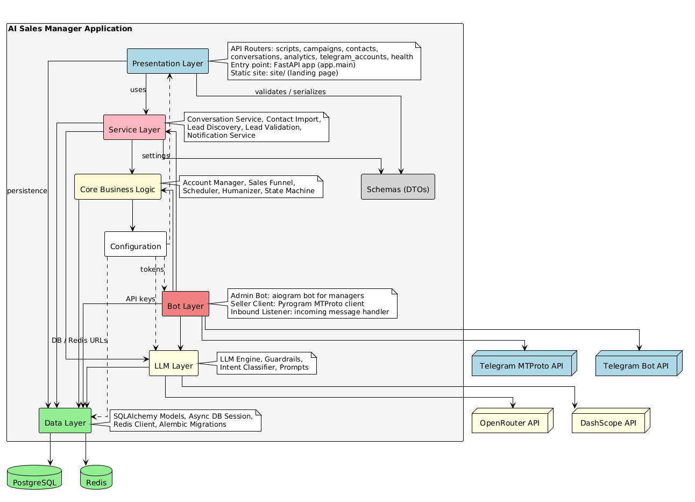
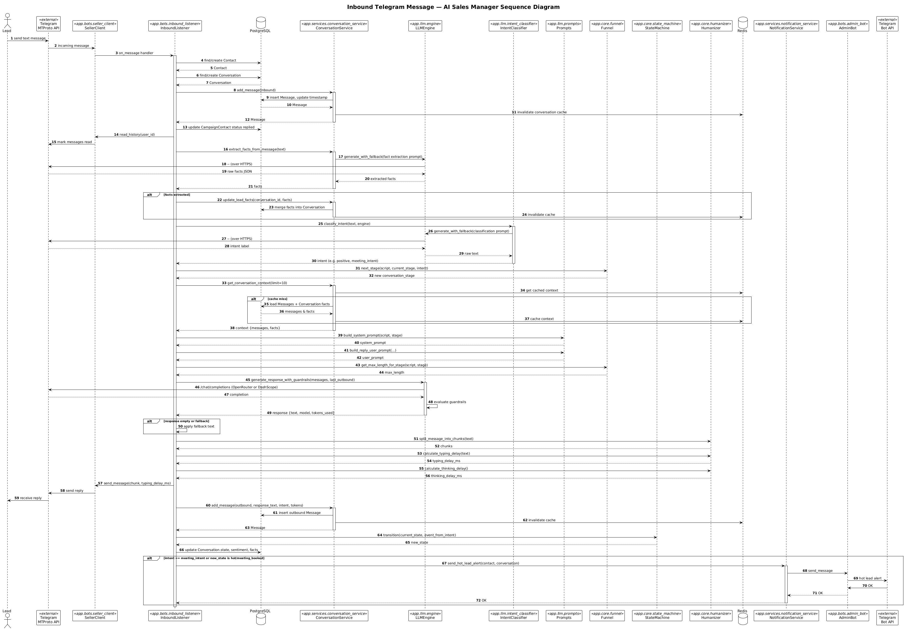
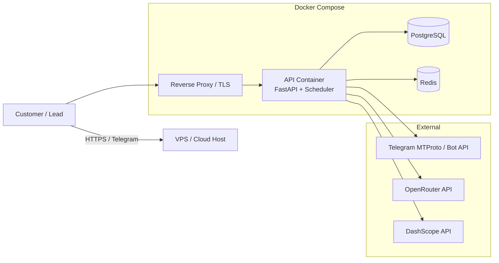

# Architecture Documentation

This document describes the architecture of AI Sales Manager as required for Assignment 5.

The architecture is documented through three architectural views:

- [Static View](#static-view) — what the system is made of.
- [Dynamic View](#dynamic-view) — how components interact during a key flow.
- [Deployment View](#deployment-view) — how the product runs in production.

Architecture decisions are recorded as [Architecture Decision Records (ADRs)](adr/).

---

## Static View

The static view is a UML component diagram showing the main internal components of the application and the external systems and databases they interact with.

[PlantUML source](static-view/component-diagram.puml)

### What the diagram shows

- **Presentation Layer** (`app.api`, `app.main`, `site/`) — FastAPI routers and the customer landing page.
- **Bot Layer** (`app.bots`) — Admin Bot (aiogram), Seller Client and Inbound Listener (Pyrogram).
- **Service Layer** (`app.services`) — conversation service, contact import, lead discovery/validation, notifications.
- **Core Business Logic** (`app.core`) — account manager, sales funnel, scheduler, humanizer, state machine.
- **LLM Layer** (`app.llm`) — engine, guardrails, intent classifier, prompt builders.
- **Data Layer** (`app.db`, `app.models`, `alembic/`) — SQLAlchemy models, async sessions, Redis client, migrations.
- **Configuration** (`app.config`) — settings and prompt configuration.

### Coupling and cohesion

The codebase is organized by technical layer. Each layer depends downward: presentation and bots depend on services and core, services depend on core and LLM, core depends on data and config. This keeps business rules in `app.core` and `app.services` cohesive, while presentation details (FastAPI, Telegram bots) are decoupled from the domain logic. The main coupling risk is that `app.bots` currently reaches directly into several layers; future work could introduce clearer ports/adapters boundaries.

### Maintainability implications

- Adding a new channel (e.g., WhatsApp) would require a new bot adapter but can reuse services, core, and LLM layers.
- Adding a new LLM provider requires changes only in `app/llm/engine.py` and configuration.
- Moving prompt content to `app/config/prompts/` (ADR-005) reduces churn in business logic.

### Supported quality requirements

The layered structure particularly supports:

- [QR-01](../quality-requirements.md#qr-01) — guardrails live in a dedicated LLM subcomponent.
- [QR-02](../quality-requirements.md#qr-02) — state machine is isolated in `app.core`.
- [QR-05](../quality-requirements.md#qr-05) — prompt config is isolated from code.
- [QR-06](../quality-requirements.md#qr-06) — funnel parsing is isolated in `app.services`.

---

## Dynamic View

The dynamic view shows the inbound Telegram message flow. This is the most complex routine path because it must persist the incoming message, classify intent, advance the funnel stage, generate a reply, enforce guardrails, and notify operators about hot leads.

[PlantUML source](dynamic-view/inbound-sequence-diagram.puml)

### Scenario

A lead replies to an outbound message. The system:

1. Receives the message through the Pyrogram `SellerClient`.
2. Finds or creates the `Contact` and `Conversation`.
3. Saves the inbound message and updates `CampaignContact` status.
4. Extracts facts from the message using the LLM.
5. Classifies intent (meeting_intent, positive, negative, objection, informational).
6. Advances the conversation stage through the sales funnel.
7. Loads conversation context from Redis/PostgreSQL.
8. Builds stage-specific system and user prompts.
9. Generates a reply through the LLM engine and applies guardrails.
10. Splits the reply, calculates delays, and sends it via Pyrogram.
11. Updates conversation state and sends a hot-lead alert if needed.

### Why this scenario matters

Inbound handling is where user trust is won or lost. A slow or incorrect reply damages the customer’s brand and wastes the lead. The diagram shows the integration boundaries that must remain reliable: Telegram MTProto, LLM providers, PostgreSQL, Redis, and the admin notification bot.

### Architecture decisions visible in the flow

- **Caching** — conversation context is cached in Redis to reduce repeated DB loads.
- **Guardrails** — LLM output is validated before any message is sent.
- **Funnel-driven prompts** — `app.core.funnel` and `app.llm.prompts` cooperate so replies match the current stage.
- **Notifications** — hot-lead alerts are sent asynchronously through the notification service.

### Related ADRs

- [ADR-001 — LLM Output Guardrails](adr/ADR-001.md)
- [ADR-002 — Deterministic Conversation State Machine](adr/ADR-002.md)
- [ADR-005 — External Prompt Configuration and Versioning](adr/ADR-005.md)
- [ADR-006 — Funnel Upload and Preview API](adr/ADR-006.md)

---

## Deployment View

The product runs as a set of Docker containers orchestrated by Docker Compose.

### What the diagram shows

- A single VPS/cloud host runs `docker-compose`.
- `postgres` and `redis` are managed as Docker services with persistent volumes and health checks.
- The `api` container runs FastAPI, APScheduler, and the inbound/outbound Telegram clients.
- A reverse proxy (e.g., Nginx or Traefik) terminates TLS and forwards to the API container.
- External dependencies are Telegram (MTProto and Bot API), OpenRouter, and DashScope.

### Why this model was chosen

Docker Compose keeps operational complexity low while still providing clear service boundaries, persistent storage, restart policies, and health checks. It matches the team’s current scale and can be migrated to Kubernetes later without changing the application code.

### Operational considerations

- All containers use `restart: unless-stopped`.
- The `api` container has a Docker `healthcheck` on `GET /health`.
- Logs are written to stderr and collected by the host or a log shipper.
- Secrets (API keys, Telegram tokens, session encryption key) are injected through environment variables, never committed.

### Related ADRs

- [ADR-007 — Production Monitoring and Logging](adr/ADR-007.md)

---

## Architecture Decision Records

All ADRs are stored in [`docs/architecture/adr/`](adr/).

| ADR | Title | Quality requirements addressed |
|---|---|---|
| [ADR-001](adr/ADR-001.md) | LLM Output Guardrails | [QR-01](../quality-requirements.md#qr-01) |
| [ADR-002](adr/ADR-002.md) | Deterministic Conversation State Machine | [QR-02](../quality-requirements.md#qr-02) |
| [ADR-003](adr/ADR-003.md) | Scheduler-Driven Outbound Processing | [QR-03](../quality-requirements.md#qr-03) |
| [ADR-004](adr/ADR-004.md) | Anti-Repetition Check for Generated Messages | [QR-04](../quality-requirements.md#qr-04) |
| [ADR-005](adr/ADR-005.md) | External Prompt Configuration and Versioning | [QR-05](../quality-requirements.md#qr-05) |
| [ADR-006](adr/ADR-006.md) | Funnel Upload and Preview API | [QR-06](../quality-requirements.md#qr-06) |
| [ADR-007](adr/ADR-007.md) | Production Monitoring and Logging | [QR-07](../quality-requirements.md#qr-07) |
| [ADR-008](adr/ADR-008.md) | AI-Automation Rate Tracking | [QR-08](../quality-requirements.md#qr-08) |

---

## Quality Requirements and Architecture

Quality requirements are defined in [`docs/quality-requirements.md`](../quality-requirements.md) and traced to automated tests in [`docs/quality-requirement-tests.md`](../quality-requirement-tests.md). The architecture supports these requirements by isolating concerns:

- Safety and correctness are enforced in dedicated `app.llm` and `app.core` components.
- Modifiability is supported by external configuration (`app.config.prompts/`) and a dedicated funnel parser.
- Availability is supported by health checks, structured logging, and container restart policies.
- Accuracy of business metrics is supported by keeping tracking fields close to the domain model (`Conversation.was_escalated`).
