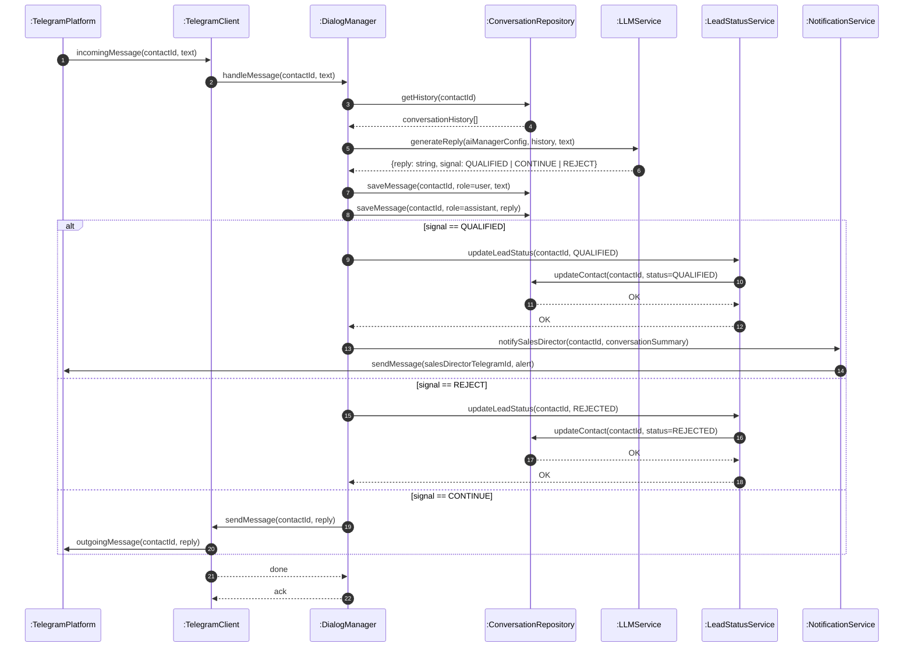

# Dynamic View — AI Sales Manager

## Chosen Scenario: AI-Driven Telegram Reply Processing

**Why this scenario?**
This is the core value-delivering flow of the system. When a lead replies on Telegram, the system must: retrieve conversation history, call an LLM to generate a contextual reply or detect qualification, persist results, and conditionally notify the Sales Director. It spans five distinct components with multiple synchronous and asynchronous transactions — making it the most architecturally revealing scenario.

---

## UML Sequence Diagram

---

## Component Roles

| Component | Responsibility |
|-----------|---------------|
| `:TelegramPlatform` | External Telegram API/MTProto network — delivers and receives messages |
| `:TelegramClient` | Pyrofork/Telethon wrapper — listens for incoming events, sends outgoing messages |
| `:DialogManager` | Core orchestrator — routes messages, manages the conversation loop |
| `:ConversationRepository` | Persistence layer — stores message history and contact status |
| `:LLMService` | LLM abstraction (Qwen / Gemini / DeepSeek) — generates contextual replies and qualification signals |
| `:LeadStatusService` | Manages lead funnel state transitions (cold → warm → hot → qualified/rejected) |
| `:NotificationService` | Sends Telegram bot alerts to the Sales Director on key events |

---

## Quality Characteristic Reasoning

**Primary: Performance Efficiency (Response Latency)**

The sequence diagram makes latency bottlenecks visible:
- Steps 5–6 (LLM call) are the dominant latency source — network round-trip to external LLM API.
- Steps 3–4 (DB read) and 7–8 (DB writes) add sequential I/O cost.
- The `alt` branch (steps 9–17) adds conditional work on top of the base path.

By reading the diagram, the team can reason: "Can we parallelize DB history fetch and LLM warm-up?" and "Should we make the notification (step 16) async to unblock the response path?"

**Secondary: Reliability (Fault Tolerance)**

The diagram exposes single points of failure:
- If `:LLMService` times out (step 6), the dialogue stalls — a retry or fallback LLM must be designed.
- If `:TelegramClient` fails to deliver the reply (step 17), the lead is silently uncontacted — a dead-letter queue or retry mechanism is needed.

These failure modes are invisible in the Static Component Diagram but become obvious in the sequence view.

---

## Diagram Source

Tool: [Mermaid](https://mermaid.js.org/) — renders natively in GitHub Markdown.
