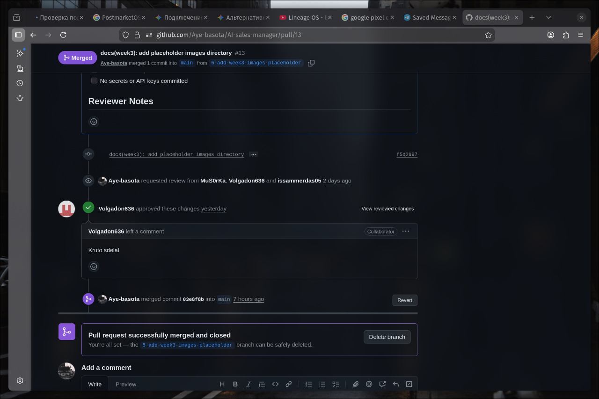

# Assignment 3 — Week 3 Report

## Project

**AI Sales Manager** — autonomous B2B outbound sales assistant for Telegram, driven by LLM dialogue and real MTProto accounts.

- [LICENSE](../../LICENSE)
- [Root README.md](../../README.md)

## Summary of Scope Since Assignment 2

In Assignment 2 the team documented 10 user stories in [`reports/week2/user-stories.md`](../../reports/week2/user-stories.md). For Assignment 3 these stories were migrated to the issue-based Product Backlog and refined into PBIs. The current registry lives in [`docs/user-stories.md`](../../docs/user-stories.md).

MVP v1 was scoped to the core sales-automation flow (all Must Have stories):

- [`US-01`](https://github.com/Aye-basota/AI-sales-manager/issues/3) — Getting product information
- [`US-02`](https://github.com/Aye-basota/AI-sales-manager/issues/4) — Contact Product Owner
- [`US-03`](https://github.com/Aye-basota/AI-sales-manager/issues/5) — Bot Setup and Funnel Upload
- [`US-04`](https://github.com/Aye-basota/AI-sales-manager/issues/6) — Labor Cost Reduction
- [`US-011`](https://github.com/Aye-basota/AI-sales-manager/issues/16) — Import Contact Base from CSV
- [`US-012`](https://github.com/Aye-basota/AI-sales-manager/issues/17) — Launch Outreach Campaign

All MVP v1 PBIs are labelled [`mvp-v1`](https://github.com/Aye-basota/AI-sales-manager/issues?q=is%3Aissue+label%3Amvp-v1).

## Customer Feedback Addressed in MVP v1

- Request for a configurable sales funnel → implemented as a 4-stage funnel (hook → qualification → value → CTA).
- Need to balance quality and API cost → added DashScope provider support alongside OpenRouter.
- Desire for messenger-based management → Admin Telegram Bot supports script creation and analytics.

## Product Backlog and Sprint Artifacts

| Artifact | Link |
|---|---|
| Product Backlog board | [GitHub Projects — Product Backlog](https://github.com/users/Aye-basota/projects/1/views/1) |
| Current Sprint Backlog board | [GitHub Projects — Sprint 1](https://github.com/users/Aye-basota/projects/2) |
| Sprint 1 milestone | [Sprint 1 — 2026-06-09..2026-06-20](https://github.com/Aye-basota/AI-sales-manager/milestone/1) |
| MVP v1 grouped view | [MVP v1 issues](https://github.com/Aye-basota/AI-sales-manager/issues?q=is%3Aissue+label%3Amvp-v1) |

## Backlog Size

- **Total Product Backlog:** 107 Story Points (79 SP across 15 user stories + 28 SP across 10 technical PBIs)
- **Sprint 1 Size:** 78 Story Points (50 SP user stories + 28 SP technical tasks)
- **MVP v1 User Story SP:** 29 SP (US-01: 5 + US-02: 3 + US-03: 8 + US-04: 3 + US-011: 5 + US-012: 8 + supporting tech tasks)

## MVP v1 Scope

MVP v1 delivers a working end-to-end outbound funnel:

1. Sales directors can create scripts with a configurable funnel via API or Admin Bot.
2. The system generates stage-aware first messages and replies using an LLM.
3. Conversations progress through hook → qualification → value → CTA based on lead intent.
4. Positive responses and meeting intents are flagged as hot leads and alerted to operators.
5. Multiple LLM providers (OpenRouter and DashScope) can be selected via environment variables.

## PBI Tracking Approach

- **Types:** User Story, Other PBI (technical/infrastructure), Course Task, Bug Report.
- **Statuses:** To Do → In Progress → In Review → Done (canonical Work Status values).
- **Sprint milestone:** Sprint 1 groups the selected Sprint Backlog.
- **MVP version:** Label `mvp-v1` marks all PBIs in the first release.
- **Decomposition:** Large stories are split into linked technical PBIs (e.g., schema migration, prompt updates, scheduler integration).

## Roadmap

Short-term focus for Sprint 2 is operator takeover, inbound rate limiting, and funnel analytics. See [`docs/roadmap.md`](../../docs/roadmap.md).

## Verification Evidence

- All tests pass: `419 passed` (run locally and in CI).
- Funnel logic covered by `tests/test_core_funnel.py`.
- Funnel-aware prompts covered by `tests/test_llm_funnel_prompts.py`.
- LLM provider switch covered by existing engine tests plus new provider-selection path.
- Campaign action buttons covered by `tests/test_bots_admin_bot.py`.

## Current Product Status

MVP v1 is **feature-complete and tested**. The funnel is configurable, LLM provider selection is implemented, and the Admin Bot exposes funnel-aware script creation. The code is ready for local execution and Docker deployment.

## Next Steps

1. Create and merge an issue-linked PR to complete workflow evidence.
2. Review a teammate's PR and leave a meaningful comment.
3. Set up a persistent staging deployment.
4. Open Sprint 2 for operator takeover and rate-limiting PBIs.

## Contribution Traceability

| Team member | GitHub | Role | Issues Owned | PRs | Reviews |
|---|---|---|---|---|---|
| Isaam | @issammerdas05 | Lead Generation & Data Engineer | [#3](../../issues/3) US-01, [#4](../../issues/4) US-02, [#12](../../issues/12) US-010, [#27](../../issues/27) TECH-07, [#28](../../issues/28) TECH-08 | — | — |
| Marsel | @Aye-basota | Backend Developer | [#5](../../issues/5) US-03, [#9](../../issues/9) US-07, [#10](../../issues/10) US-08, [#17](../../issues/17) US-012, [#24](../../issues/24) TECH-04, [#29](../../issues/29) TECH-09, [#30](../../issues/30) TECH-10 | — | — |
| Marat | @Markyl018 | Product Analyst | [#6](../../issues/6) US-04, [#8](../../issues/8) US-06, [#20](../../issues/20) US-015, [#26](../../issues/26) TECH-06 | — | — |
| Maksim | @MuS0rKa | Technical Analyst | [#7](../../issues/7) US-05, [#11](../../issues/11) US-09, [#18](../../issues/18) US-013, [#25](../../issues/25) TECH-05 | — | — |
| Daniil | @Volgadon636 | Team Lead & Interviewer | [#4](../../issues/4) US-02 (reviewer), [#16](../../issues/16) US-011 (reviewer context), [#19](../../issues/19) US-014, [#23](../../issues/23) TECH-03 | — | — |

> Update PR and Review columns once issue-linked PRs are opened and reviewed during Assignment 3.

## Release and Documentation

| Artifact | Link |
|---|---|
| SemVer release for MVP v1 | [v0.1.0](https://github.com/Aye-basota/AI-sales-manager/releases/tag/v0.1.0) |
| CHANGELOG | [CHANGELOG.md](../../CHANGELOG.md) |
| Process Requirements | [Process_Requirements.md](../../Process_Requirements.md) |
| Roadmap | [docs/roadmap.md](../../docs/roadmap.md) |
| Definition of Done | [docs/definition-of-done.md](../../docs/definition-of-done.md) |
| Issue templates | [`.github/ISSUE_TEMPLATE`](../../.github/ISSUE_TEMPLATE) |
| Extended PR template | [`.github/pull_request_template.md`](../../.github/pull_request_template.md) |

## Reviewed PRs

- *(To be added after creating and reviewing PRs during Assignment 3)*

## Delivered MVP v1

- **Local / Docker:** follow [root README.md](../../README.md#быстрый-старт-docker).
- **API docs:** `http://localhost:8000/docs` after startup.

## Video Demonstration

- [MVP v1 demo (Google Drive)](https://drive.google.com/file/d/1M_hOEDzeCzJ5AxQ8Ix0v1Udy51Z5HnR6/view?usp=sharing)

## Screenshots

| View | Screenshot |
|---|---|
| Product Backlog |  |
| Sprint Backlog |  |
| Sprint milestone |  |
| SemVer release |  |
| Delivered MVP v1 |  |
| Reviewed PR |  *(add after PR is merged)* |

## Customer Review

- **Transcript / notes:** [customer-review-summary.md](customer-review-summary.md)
- **Recording:** shared privately with instructors via Moodle *(or replace with public link if permitted)*

## Reflection and Retrospective

- [Week 3 reflection](reflection.md)
- [Sprint retrospective](retrospective.md)
- [LLM usage report](llm-report.md)
