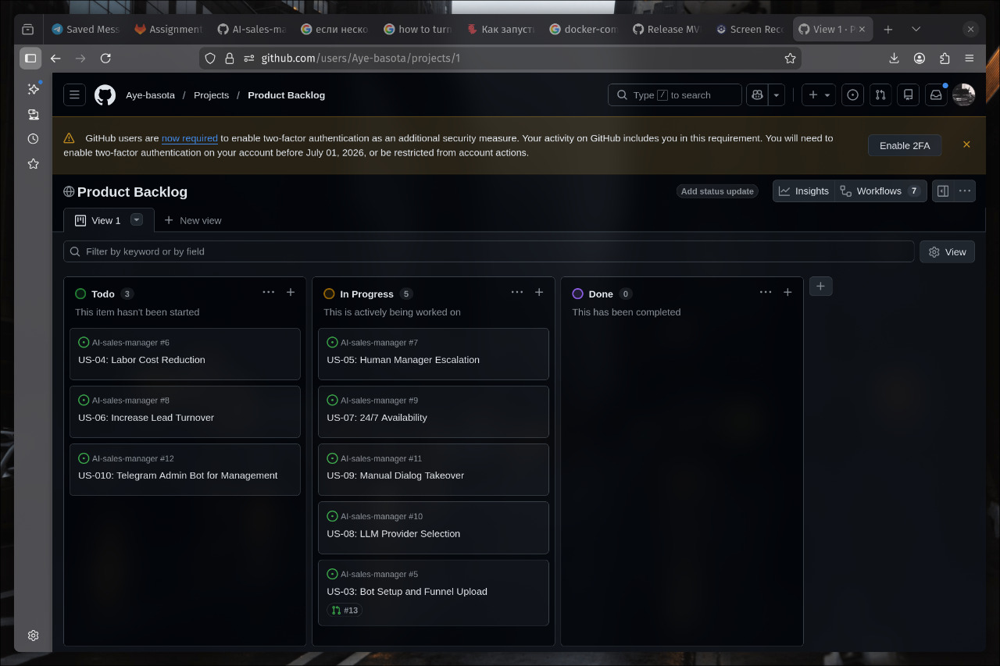
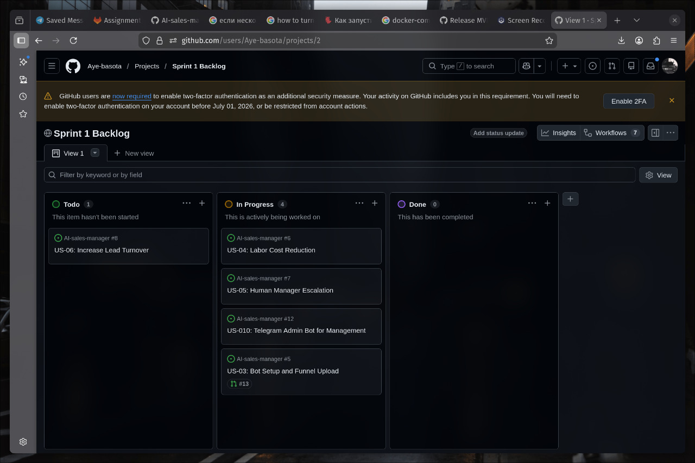
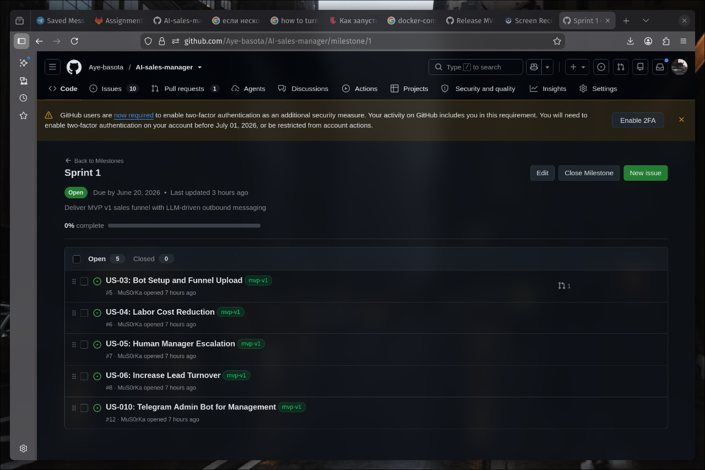
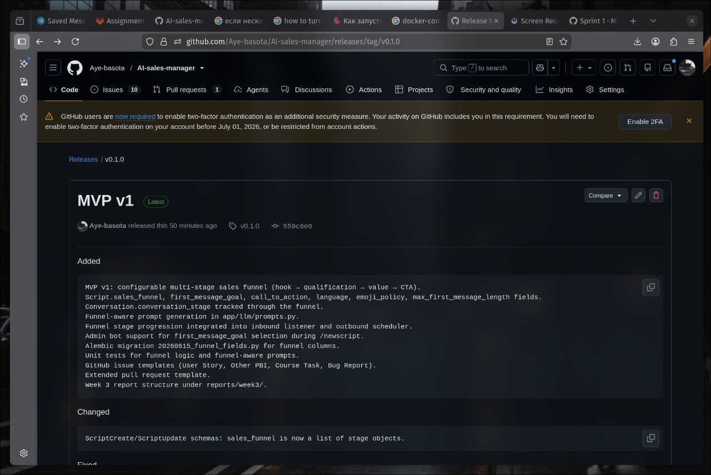
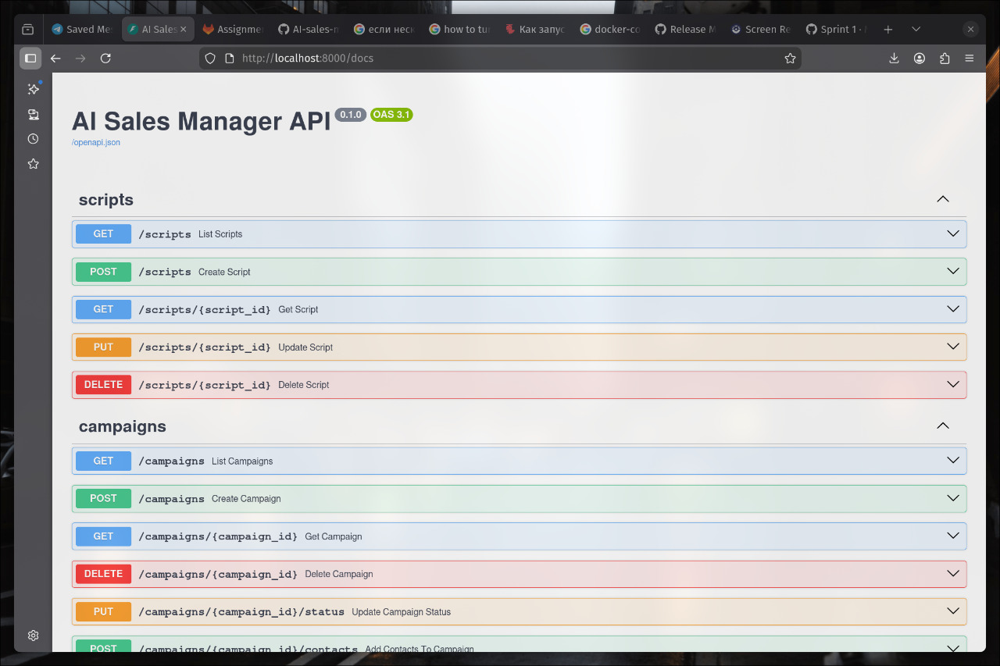

# Assignment 3 — Week 3 Report

## Project

**AI Sales Manager** — autonomous B2B outbound sales assistant for Telegram, driven by LLM dialogue and real MTProto accounts. The system lets Sales Directors create AI-managed outreach campaigns, monitor live conversations, and qualify leads automatically.

- [LICENSE](../../LICENSE)
- [Root README.md](../../README.md)

---

## Scope Since Assignment 2

In Assignment 2 the team documented 10 user stories in [`reports/week2/user-stories.md`](../week2/user-stories.md).

For Assignment 3 those stories were migrated to the issue-based Product Backlog, refined, and extended with 5 new user stories and 10 technical PBIs.

Current authoritative registry: [`docs/user-stories.md`](../../docs/user-stories.md)

**Changes since Assignment 2:**
- All 10 original stories migrated to GitHub Issues with stable IDs, MoSCoW labels, SP labels, Work Status labels, and type labels.
- 5 new user stories added (US-011 – US-015).
- 10 technical sub-tasks added (TECH-01 – TECH-10), each linked to a parent user story.
- 6 Must Have stories selected for MVP v1 and labelled `mvp-v1`.
- Sprint 1 milestone created and 78 SP of work assigned to it.

---

## Customer Feedback Addressed in MVP v1

| Assignment 2 Feedback | How Addressed in MVP v1 |
|---|---|
| Need a configurable sales funnel | Implemented 4-stage funnel (hook → qualification → value → CTA) via `sales_funnel` field on scripts |
| Balance LLM quality vs. API cost | Added DashScope provider alongside OpenRouter; switchable via environment variable |
| Prefer messenger-based management | Admin Telegram Bot supports script creation, funnel configuration, and analytics without opening a web UI |

---

## Product Backlog and Sprint Artifacts

| Artifact | Link |
|---|---|
| Historical Assignment 2 user stories | [reports/week2/user-stories.md](../week2/user-stories.md) |
| Current user-story index | [docs/user-stories.md](../../docs/user-stories.md) |
| Product Backlog board | [GitHub Projects — Product Backlog](https://github.com/users/Aye-basota/projects/1/views/1) |
| Sprint Backlog board | [GitHub Projects — Sprint 1 Backlog](https://github.com/users/Aye-basota/projects/2) |
| Sprint 1 milestone | [Sprint 1 — 14 Jun – 28 Jun 2026](https://github.com/Aye-basota/AI-sales-manager/milestone/1) |
| MVP v1 filtered view | [Issues labelled mvp-v1](https://github.com/Aye-basota/AI-sales-manager/issues?q=is%3Aissue+label%3Amvp-v1) |

---

## Backlog Size

| Metric | Value |
|---|---|
| Total qualifying PBIs | 25 (15 user stories + 10 technical) |
| **Total Product Backlog** | **107 Story Points** (79 SP user stories + 28 SP technical) |
| **Sprint 1 size** | **78 Story Points** (50 SP user stories + 28 SP technical tasks) |
| MVP v1 user-story SP | 32 SP (US-01: 5 + US-02: 3 + US-03: 8 + US-04: 3 + US-011: 5 + US-012: 8) |

---

## MVP v1 Scope

MVP v1 delivers a working end-to-end outbound Telegram funnel. The selected PBIs are labelled [`mvp-v1`](https://github.com/Aye-basota/AI-sales-manager/issues?q=is%3Aissue+label%3Amvp-v1).

| ID | Story | Issue | SP |
|---|---|---|---|
| US-01 | Getting product information | [#3](https://github.com/Aye-basota/AI-sales-manager/issues/3) | 5 |
| US-02 | Contact product owner | [#4](https://github.com/Aye-basota/AI-sales-manager/issues/4) | 3 |
| US-03 | Bot setup and funnel upload | [#5](https://github.com/Aye-basota/AI-sales-manager/issues/5) | 8 |
| US-04 | Labor cost reduction | [#6](https://github.com/Aye-basota/AI-sales-manager/issues/6) | 3 |
| US-011 | Import contact base from CSV | [#16](https://github.com/Aye-basota/AI-sales-manager/issues/16) | 5 |
| US-012 | Launch outreach campaign | [#17](https://github.com/Aye-basota/AI-sales-manager/issues/17) | 8 |

Supporting technical PBIs (TECH-01 – TECH-10, 28 SP) are all assigned to Sprint 1 and provide the infrastructure required by the MVP v1 stories.

---

## PBI Tracking Approach

- **Types:** `type:user-story` · `type:technical` (used as labels on every issue).
- **Work Status:** `status:to-do` → `status:in-progress` → `status:in-review` → `status:done` (canonical values from `Process_Requirements.md`).
- **MoSCoW priority:** Must Have / Should Have / Could Have / Won't Have.
- **Story Points:** Fibonacci scale — `sp:2` `sp:3` `sp:5` `sp:8` `sp:13`.
- **Sprint milestone:** Sprint 1 milestone is the authoritative container for Sprint-selected PBIs. The Sprint Backlog board shows the same milestone-scoped set.
- **MVP version:** Label `mvp-v1` marks every PBI included in the first release.
- **Decomposition:** Large user stories are split into smaller linked technical PBIs (e.g., TECH-01: DB schema migration, TECH-02: LLM prompt refactor). Each technical PBI references its parent story in the issue body.

---

## Roadmap Summary

Sprint 1 delivers the core outbound funnel (CSV import → campaign launch → AI dialogue → lead qualification). Sprint 2 will focus on operator manual takeover, inbound rate limiting, Redis conversation locks, and funnel analytics.

Full roadmap: [`docs/roadmap.md`](../../docs/roadmap.md)

---

## Verification Evidence for MVP v1

- All automated tests pass: `419 passed` (run locally and in CI).
- Funnel logic covered by `tests/test_core_funnel.py`.
- Funnel-aware LLM prompts covered by `tests/test_llm_funnel_prompts.py`.
- Multi-provider LLM switch covered by engine tests and new provider-selection path.
- Admin Bot campaign actions covered by `tests/test_bots_admin_bot.py`.
- Acceptance criteria for each Sprint 1 PBI are recorded in the linked GitHub Issues.

---

## Current Product Status

MVP v1 is **feature-complete and tested**. The 4-stage configurable sales funnel works end-to-end: CSV contact import, campaign creation, LLM-driven Telegram outreach, funnel stage tracking, and Admin Bot management. The system is runnable locally and via Docker.

---

## Next Steps

1. Create and merge issue-linked PRs to complete the team workflow evidence.
2. Every team member reviews and approves at least one PR.
3. Set up a persistent staging deployment for customer demos.
4. Open Sprint 2: operator takeover, rate limiting, and funnel analytics PBIs.

---

## Contribution Traceability

| Team Member | GitHub | Role | Issues Owned | PRs | Reviews |
|---|---|---|---|---|---|
| Issam | [@issammerdas05](https://github.com/issammerdas05) | Lead Generation & Data Engineer | [#3](https://github.com/Aye-basota/AI-sales-manager/issues/3) US-01 · [#4](https://github.com/Aye-basota/AI-sales-manager/issues/4) US-02 · [#12](https://github.com/Aye-basota/AI-sales-manager/issues/12) US-010 · [#27](https://github.com/Aye-basota/AI-sales-manager/issues/27) TECH-07 · [#28](https://github.com/Aye-basota/AI-sales-manager/issues/28) TECH-08 | *(add link)* | *(add link)* |
| Marsel | [@Aye-basota](https://github.com/Aye-basota) | Backend Developer | [#5](https://github.com/Aye-basota/AI-sales-manager/issues/5) US-03 · [#9](https://github.com/Aye-basota/AI-sales-manager/issues/9) US-07 · [#10](https://github.com/Aye-basota/AI-sales-manager/issues/10) US-08 · [#17](https://github.com/Aye-basota/AI-sales-manager/issues/17) US-012 · [#24](https://github.com/Aye-basota/AI-sales-manager/issues/24) TECH-04 · [#29](https://github.com/Aye-basota/AI-sales-manager/issues/29) TECH-09 · [#30](https://github.com/Aye-basota/AI-sales-manager/issues/30) TECH-10 | *(add link)* | *(add link)* |
| Marat | [@Markyl018](https://github.com/Markyl018) | Product Analyst | [#6](https://github.com/Aye-basota/AI-sales-manager/issues/6) US-04 · [#8](https://github.com/Aye-basota/AI-sales-manager/issues/8) US-06 · [#20](https://github.com/Aye-basota/AI-sales-manager/issues/20) US-015 · [#26](https://github.com/Aye-basota/AI-sales-manager/issues/26) TECH-06 | *(add link)* | *(add link)* |
| Maksim | [@MuS0rKa](https://github.com/MuS0rKa) | Technical Analyst | [#7](https://github.com/Aye-basota/AI-sales-manager/issues/7) US-05 · [#11](https://github.com/Aye-basota/AI-sales-manager/issues/11) US-09 · [#18](https://github.com/Aye-basota/AI-sales-manager/issues/18) US-013 · [#25](https://github.com/Aye-basota/AI-sales-manager/issues/25) TECH-05 | *(add link)* | *(add link)* |
| Daniil | [@Volgadon636](https://github.com/Volgadon636) | Team Lead & Interviewer | [#19](https://github.com/Aye-basota/AI-sales-manager/issues/19) US-014 · [#23](https://github.com/Aye-basota/AI-sales-manager/issues/23) TECH-03 | *(add link)* | *(add link)* |

> Update PR and Review columns once issue-linked PRs are opened and reviewed.

---

## Release and Documentation Links

| Artifact | Link |
|---|---|
| SemVer release for MVP v1 | [v0.1.0](https://github.com/Aye-basota/AI-sales-manager/releases/tag/v0.1.0) |
| CHANGELOG | [CHANGELOG.md](../../CHANGELOG.md) |
| Process Requirements | [Process_Requirements.md](../../Process_Requirements.md) |
| Roadmap | [docs/roadmap.md](../../docs/roadmap.md) |
| Definition of Done | [docs/definition-of-done.md](../../docs/definition-of-done.md) |
| Issue templates | [`.github/ISSUE_TEMPLATE/`](../../.github/ISSUE_TEMPLATE) |
| PR template | [`.github/pull_request_template.md`](../../.github/pull_request_template.md) |

---

## Reviewed PRs (Assignment 3 Workflow Evidence)

| PR | Author | Reviewer | Status |
|---|---|---|---|
| [#31](https://github.com/Aye-basota/AI-sales-manager/pull/31) Assignment 3 backlog | *(add)* | *(add)* | Open |

> Add reviewed, issue-linked PRs here as they are created and approved during Assignment 3.

---

## Delivered MVP v1

- **Local / Docker:** follow [root README.md run instructions](../../README.md#быстрый-старт-docker).
- **API docs:** `http://localhost:8000/docs` after startup.

---

## Video Demonstration

[MVP v1 demo — Google Drive (< 2 min)](https://drive.google.com/file/d/1M_hOEDzeCzJ5AxQ8Ix0v1Udy51Z5HnR6/view?usp=sharing)

---

## Screenshots

| View | Screenshot |
|---|---|
| Product Backlog |  |
| Sprint Backlog |  |
| Sprint milestone |  |
| MVP v1 labelled view |  |
| SemVer release |  |
| Delivered MVP v1 |  |
| Reviewed PR | *(add screenshot after PR is merged)* |

---

## Customer Review

- [Customer review summary](customer-review-summary.md)
- Customer review transcript: shared privately with instructors via Moodle (public publication not permitted by customer).

---

## Reflection, Retrospective, and LLM Report

- [Week 3 reflection](reflection.md)
- [Sprint retrospective](retrospective.md)
- [LLM usage report](llm-report.md)
