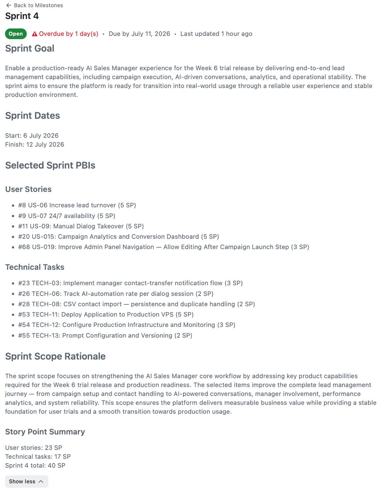
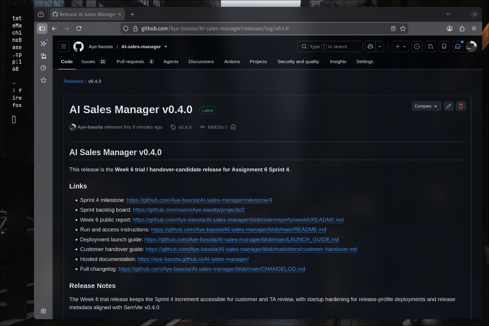
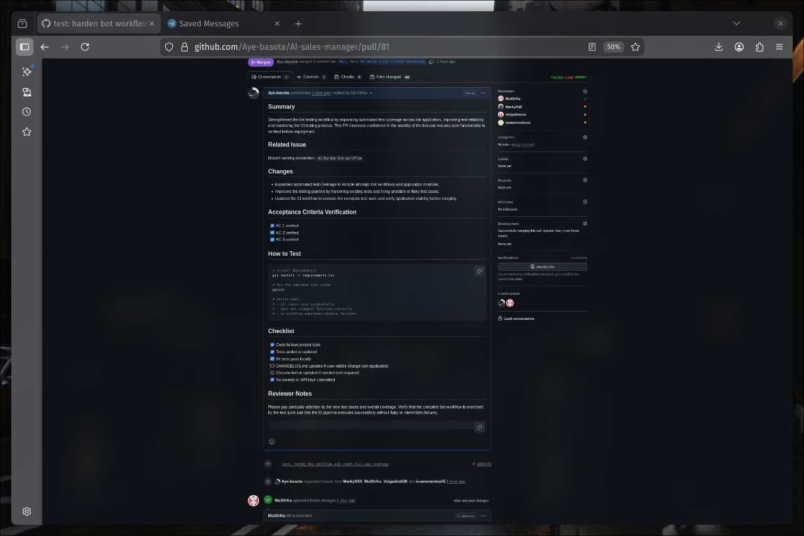
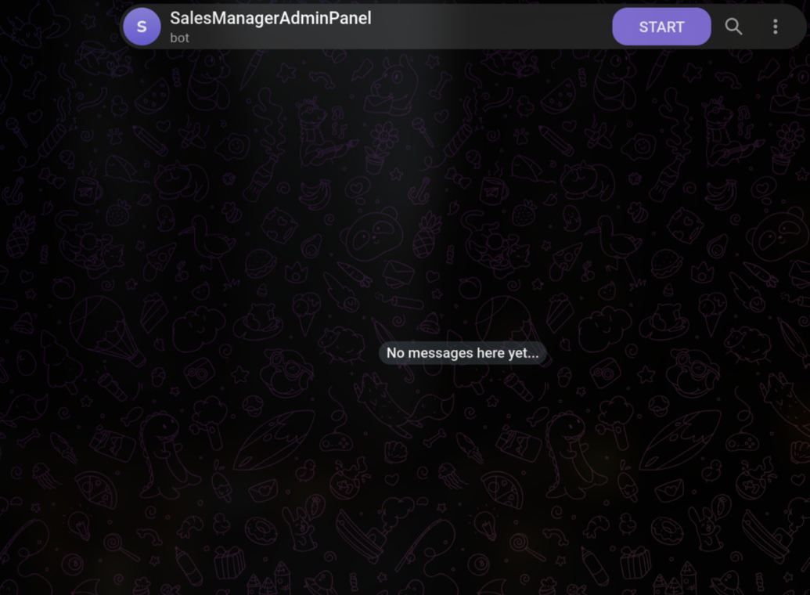

# Week 6 - Assignment 6 Sprint 4 Report

## Project

**Project name:** AI Sales Manager

**Short description:** Autonomous B2B outbound sales assistant using real Telegram accounts and LLM-driven dialogue to find, contact, qualify, and hand over interested leads.

## Backlog And Sprint Planning

- [Product Backlog board](https://github.com/users/Aye-basota/projects/1/views/1)
- [Sprint 4 Backlog board](https://github.com/users/Aye-basota/projects/2)
- [Sprint 4 milestone](https://github.com/Aye-basota/AI-sales-manager/milestone/4)

**Sprint 4 dates:** 2026-07-06 - 2026-07-12

**Sprint 4 Goal:** Enable a production-ready AI Sales Manager experience for the Week 6 trial release by delivering end-to-end lead management capabilities, including campaign execution, AI-driven conversations, analytics, and operational stability.

**Scope summary:** Sprint 4 focused on trial-readiness, campaign workflow hardening, Telegram lead discovery, improved conversation behavior, operational checks, and handover documentation.

**Total Sprint 4 size:** 40 Story Points according to the Sprint 4 milestone description.

## Week 6 Trial Release Changes

The inspected Week 6 increment includes:

- Admin Bot workflow improvements for business/script setup, CSV upload, campaign launch, campaign pause/resume/delete, analytics, hot leads, and recent conversation review.
- Lead discovery via Telegram public/group message search and CSV export.
- Stronger inbound conversation handling, including chunked-message batching, safer fallback replies, rate-limit checks, and guardrail hardening.
- Release/startup hardening for environment parsing and API metadata aligned with `0.4.0`.
- Customer-facing documentation updates: [README.md](../../README.md), [CONTRIBUTING.md](../../CONTRIBUTING.md), [AGENTS.md](../../AGENTS.md), and [docs/customer-handover.md](../../docs/customer-handover.md).

## Product Access

- **Week 6 product access artifact:** Telegram Admin Bot / live bot trial instance: [@salesmanager228_bot](https://t.me/salesmanager228_bot). For this bot/integration product, the access artifact is the bot entry point plus the live backend that powers it.
- Current public run/access guidance: [README.md](../../README.md) and [LAUNCH_GUIDE.md](../../LAUNCH_GUIDE.md)
- Current handover/access status: [docs/customer-handover.md](../../docs/customer-handover.md)
- Hosted documentation site: <https://aye-basota.github.io/AI-sales-manager/>

## Maintained Entry Points

- [README.md](../../README.md)
- [CONTRIBUTING.md](../../CONTRIBUTING.md)
- [AGENTS.md](../../AGENTS.md)
- [docs/customer-handover.md](../../docs/customer-handover.md)
- [docs/roadmap.md](../../docs/roadmap.md)
- [docs/development-process.md](../../docs/development-process.md)
- [docs/definition-of-done.md](../../docs/definition-of-done.md)
- [docs/testing.md](../../docs/testing.md)
- [docs/quality-requirements.md](../../docs/quality-requirements.md)
- [docs/quality-requirement-tests.md](../../docs/quality-requirement-tests.md)
- [docs/user-acceptance-tests.md](../../docs/user-acceptance-tests.md)
- [docs/architecture/README.md](../../docs/architecture/README.md)

## Customer-Facing Documentation Review

The Week 6 work updated the public repository entry point and handover documentation set. The customer call primarily reviewed the live product workflow and transition readiness; the public transcript does not show a separate line-by-line customer walkthrough of every documentation page.

| Area | Week 6 result |
|---|---|
| README and run guidance | Updated for technical setup and bot-oriented access through [@salesmanager228_bot](https://t.me/salesmanager228_bot). |
| Customer handover | Updated for Assignment 6 and states that the Week 6 instance is team-controlled, with final transition still pending for Week 7. |
| Troubleshooting/support notes | Present in README and customer handover. |
| Known limitations | Present in README and customer handover, with lead-search quality and hosting/access clarity still needing follow-up. |

The customer said the demonstrated workflow was generally clear and adequate, then asked to receive the bot and test it independently. The main missing/unclear product items from the Week 6 review were stronger lead-discovery result quality, less manual setup before campaign launch, and final transition/access confirmation. If the team has separate evidence that the customer reviewed README/handover/run instructions directly, that evidence should be included in the Week 6 Moodle PDF.

## Transition-Readiness Summary

The July 12 Sprint Review/customer call produced trial-readiness evidence, but not final transition evidence.

- The product was demonstrated live to the customer.
- The customer asked to test the bot independently.
- The customer highlighted lead-search quality and reduced setup friction as important next improvements.
- The public Week 6 evidence does not yet prove customer-side deployment or customer-side operation.
- Final acceptance and final transition are Week 7 work.

**Week 7 follow-up expected from Week 6:** resolve the product access/deployment status, improve or explicitly scope lead discovery quality, reduce campaign setup friction where feasible, and collect written customer confirmation for the reached handover level.

## Customer Feedback Response

| Feedback point | Resulting PBI / action | Week 6 status |
|---|---|---|
| Lead-search/parsing quality needs improvement | Explicit Sprint 5 transition action: improve Telegram lead-discovery filtering/query quality; related contact import/export pipeline: [#28](https://github.com/Aye-basota/AI-sales-manager/issues/28) | Identified in Sprint Review |
| Customer wants minimal-setup campaign start | [#68](https://github.com/Aye-basota/AI-sales-manager/issues/68) plus explicit Sprint 5 action to reduce setup friction before launch | Identified in Sprint Review |
| Bot occasionally breaks character or exposes role/prompt weakness | [#55](https://github.com/Aye-basota/AI-sales-manager/issues/55) | Identified in Sprint Review |
| Rapid multi-message handling should be more reliable | Addressed in the Week 6 increment with chunked inbound batching and rate-limit handling; keep regression coverage active | Partially addressed |
| Customer wants independent trial access | [@salesmanager228_bot](https://t.me/salesmanager228_bot), [#53](https://github.com/Aye-basota/AI-sales-manager/issues/53), and [#54](https://github.com/Aye-basota/AI-sales-manager/issues/54) | Access artifact provided; independent-use evidence remains Week 7 follow-up |

## Feedback Not Yet Addressed

Not all Week 6 feedback is expected to be resolved inside Week 6. Lead-discovery quality, lower setup friction, prompt/model quality, and final access confirmation should be carried into Sprint 5 either through the linked existing issues above or as explicit Sprint 5 transition actions. A dedicated lead-discovery-quality issue would improve traceability, but Assignment 6 also allows explicit transition actions when the work is recorded in the Sprint 5 scope.

## UAT / Customer Trial Results

Relevant maintained UAT evidence is in [docs/user-acceptance-tests.md](../../docs/user-acceptance-tests.md).

| Scenario | Week 6 public status |
|---|---|
| UAT-001: 24/7 production availability via VPS | Previously passed in Week 5. Week 6 did not add final customer-side deployment evidence, so the handover level is not upgraded here. |
| UAT-002: Natural conversational flow and lead nurturing | Previously passed in Week 5. Week 6 live demo found remaining prompt/role-breaking risk. |
| UAT-003: Telegram lead discovery quality | Added as a Week 6 follow-up scenario; live observation indicates Needs Improvement. |
| UAT-004: Campaign analytics dashboard accuracy | Not customer-executed in Week 6; keep as Week 7 verification if analytics is transition-critical. |
| UAT-005: Minimal setup campaign launch | Added as a Week 6 follow-up scenario; customer requested less manual configuration. |

## Release And Changelog

- Week 6 SemVer trial release: [AI Sales Manager v0.4.0](https://github.com/Aye-basota/AI-sales-manager/releases/tag/v0.4.0), published 2026-07-12 from `main`.
- [CHANGELOG.md](../../CHANGELOG.md)

## Sprint Review Evidence

- Public evidence form: Week 6 transcript, sanitized notes, and summary. Private recording link and exact timecodes belong in Moodle only.
- [Sprint Review transcript](sprint-review-transcript.md)
- [Sprint Review summary](sprint-review-summary.md)
- [Sprint Review notes](sprint-review-notes.md)

## Reflection, Retrospective, And LLM Usage

- [Week 6 reflection](reflection.md)
- [Week 6 retrospective](retrospective.md)
- [Week 6 LLM usage report](llm-report.md)

## Current Product Status

The Week 6 increment is a trial/handover-candidate state, not the final Assignment 6 `MVP v3` state. The codebase has strong automated test coverage, the customer saw a live walkthrough, the Week 6 release exists, and the public bot access artifact is recorded. What still remains for Week 7 is final transition confirmation and evidence of independent customer use or customer-side operation if that level is claimed.

## Contribution Traceability

| Contributor | Publicly inspectable Week 6 evidence |
|---|---|
| Aye-basota | PRs [#77](https://github.com/Aye-basota/AI-sales-manager/pull/77) and [#81](https://github.com/Aye-basota/AI-sales-manager/pull/81): Week 6 release hardening, tests, coverage, and bot workflow reliability. |
| MuS0rKa | PRs [#75](https://github.com/Aye-basota/AI-sales-manager/pull/75) and [#76](https://github.com/Aye-basota/AI-sales-manager/pull/76); reviewer activity on Week 6 PRs including [#77](https://github.com/Aye-basota/AI-sales-manager/pull/77) and [#81](https://github.com/Aye-basota/AI-sales-manager/pull/81). |
| Volgadon636 | PRs [#79](https://github.com/Aye-basota/AI-sales-manager/pull/79), [#80](https://github.com/Aye-basota/AI-sales-manager/pull/80), [#82](https://github.com/Aye-basota/AI-sales-manager/pull/82), [#83](https://github.com/Aye-basota/AI-sales-manager/pull/83), [#84](https://github.com/Aye-basota/AI-sales-manager/pull/84), and [#85](https://github.com/Aye-basota/AI-sales-manager/pull/85): Sprint Review summaries/transcripts and report evidence. |
| Markyl018 | Sprint 4 responsibilities visible through assigned PBIs [#8](https://github.com/Aye-basota/AI-sales-manager/issues/8), [#20](https://github.com/Aye-basota/AI-sales-manager/issues/20), and [#26](https://github.com/Aye-basota/AI-sales-manager/issues/26). |
| issammerdas05 | PR [#78](https://github.com/Aye-basota/AI-sales-manager/pull/78): `CONTRIBUTING.md`, `AGENTS.md`, and customer-handover documentation; assigned PBI [#28](https://github.com/Aye-basota/AI-sales-manager/issues/28). |

## Screenshots

Assignment 6 asks for embedded screenshots when public links may not be reliably inspectable. Store sanitized screenshots in `reports/week6/images/`.

Embedded Week 6 screenshots currently committed:

Still recommended before Moodle submission:

- Add `reports/week6/images/ci-latest-run.png` if the team wants extra CI evidence in the public report; the assignment does not require it as strongly as the milestone/release/PR/access evidence.
